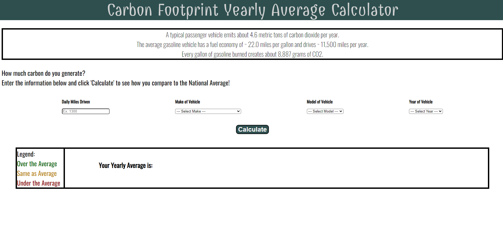

# carbon-footprint

## Description

An app that calculates a users yearly carbon footprint; based on their type of car and miles driven, and compares it to the United States average. The app stores data to calculate the average carbon footprint for multiple days.

## Image

## Built With

- HTML
- CSS
- Javascript
- Carbon Interface API
- Icons8 API
- Bulma CSS framework

## Website

https://ashleymullikan.github.io/carbon-footprint/

## Contribution

Ashley Mullikin,
Deanna Dewitt,
Jonathan Gibbings,
and Nina Serebryakova
